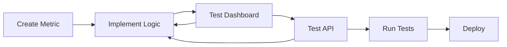

# 📊 Metrics Hub

> *Streamlined metric development and deployment package with rich outputs*

[](https://www.python.org/downloads/)
[](https://opensource.org/licenses/MIT)
[](https://fastapi.tiangolo.com)
[](https://plotly.com)

Metrics Hub is a comprehensive Python package for developing, testing, and deploying complex analytics metrics with rich outputs including **DataFrames**, **interactive visualizations**, and **mixed object types**. Built specifically for **Posit Connect** deployment with streamlined development workflows.

## ✨ Key Features

- 🏗️ **Integrated Development**: Develop metrics within the package structure
- 📊 **Rich Outputs**: Support for DataFrames, Plotly charts, and complex objects  
- 🚀 **One-Click Deployment**: Ready-to-deploy Posit Connect scripts
- 🧪 **Interactive Testing**: Built-in dashboard and API for rapid development
- 📝 **Auto-Documentation**: YAML-driven configuration with type validation
- 🔧 **Template System**: Pre-built templates for common metric patterns

## 📦 Package Structure

```
📁 metrics-hub/
├── 📁 metrics_hub/                    # 🏠 Main Package
│   ├── 📄 __init__.py                 # 📤 Package Exports
│   ├── 📄 core.py                     # 🔧 Metric Registry & Management
│   ├── 📄 api.py                      # 🌐 FastAPI Interface
│   ├── 📄 dashboard.py                # 📊 Interactive Dashboard
│   │
│   ├── 📁 metrics/                    # 📈 Metric Implementations
│   │   ├── 📄 __init__.py             # 📦 Metrics Package
│   │   ├── 📄 your_metric.py          # 🔍 Your Metric Code
│   │   └── 📄 your_metric.yaml        # ⚙️ Configuration File
│   │
│   └── 📁 scaffolding/                # 🛠️ Development Tools
│       ├── 📄 __init__.py             # 📦 Scaffolding Package
│       └── 📄 cli.py                  # 💻 Command Line Interface
│
├── 📁 tests/                          # 🧪 Test Suite
│   └── 📄 test_your_metric.py         # ✅ Generated Tests
│
├── 📄 deploy_your_metric.py           # 🚀 Posit Connect Deployment
├── 📄 pyproject.toml                  # ⚙️ Package Configuration
├── 📄 requirements.txt                # 📋 Dependencies
└── 📄 README.md                       # 📖 This File
```

## 🚀 Quick Start

### Installation

```bash
# Basic installation
pip install metrics-hub

# With all features (recommended for development)
pip install "metrics-hub[all]"

# Production deployment only
pip install "metrics-hub[api]"
```

### Create Your First Metric

```bash
# Generate a new metric with template
metrics-hub create "Sales Analysis" \
    --category financial \
    --description "Monthly sales performance analysis" \
    --template dataframe

# 📁 Generated files:
#   ├── metrics_hub/metrics/financial_sales_analysis.py
#   ├── metrics_hub/metrics/financial_sales_analysis.yaml  
#   ├── tests/test_financial_sales_analysis.py
#   └── deploy_financial_sales_analysis.py
```

### Implement Your Metric

The generated metric template includes everything you need:

```python
# metrics_hub/metrics/financial_sales_analysis.py
from metrics_hub import register_metric
import pandas as pd
import plotly.express as px

@register_metric("financial_sales_analysis")
def calculate_sales_analysis(
    data_source: str,
    date_range: dict,
    filters: dict = None
) -> dict:
    """Monthly sales performance analysis."""
    
    # Your implementation here
    df = load_sales_data(data_source, date_range)
    
    if filters:
        df = apply_filters(df, filters)
    
    # Create visualization
    chart = px.line(df, x='date', y='sales', title='Sales Trend')
    
    # Calculate summary
    summary = {
        'total_sales': df['sales'].sum(),
        'avg_monthly': df['sales'].mean(),
        'growth_rate': calculate_growth_rate(df)
    }
    
    return {
        'sales_data': df,           # 📊 DataFrame output
        'trend_chart': chart,       # 📈 Interactive chart
        'summary_stats': summary    # 📋 Key metrics
    }
```

### Test Interactively

```bash
# Launch dashboard for testing
metrics-hub dashboard
# 🌐 Visit: http://localhost:8050

# Or start API server
metrics-hub api
# 🌐 Visit: http://localhost:8000/docs
```

### Deploy to Posit Connect

```bash
# Test deployment locally
python deploy_financial_sales_analysis.py

# Deploy to Posit Connect
rsconnect deploy fastapi deploy_financial_sales_analysis.py \
    --account myaccount \
    --title "Sales Analysis API"
```

## 🎯 Use Cases & Templates

### 📊 DataFrame Analytics
Perfect for data analysis and reporting:
```bash
metrics-hub create "Portfolio Performance" \
    --template dataframe \
    --category investment
```

### 📈 Interactive Visualizations  
For dashboard-ready charts:
```bash
metrics-hub create "Market Trends" \
    --template plotly \
    --category operational
```

### 🔗 Multi-Source Analytics
For comprehensive analysis:
```bash
metrics-hub create "Risk Assessment" \
    --template multi_source \
    --category risk
```

### ⚡ Simple Calculations
For quick numeric metrics:
```bash
metrics-hub create "KPI Calculator" \
    --template simple \
    --category performance
```

## 🛠️ Advanced Features

### Rich Output Types

Metrics Hub supports multiple output formats automatically:

```python
# 📊 DataFrame → JSON/HTML/CSV
return pd.DataFrame({'portfolio': ['A', 'B'], 'return': [0.12, 0.08]})

# 📈 Plotly Figure → JSON/HTML/Interactive
return px.scatter(df, x='risk', y='return', title='Risk vs Return')

# 🎯 Mixed Objects → Structured Response
return {
    'analysis': dataframe,      # Table format
    'chart': plotly_figure,     # Interactive chart
    'metrics': {'roi': 0.15}    # Key numbers
}
```

### API Endpoints

Each metric automatically gets multiple endpoints:

```bash
# 📋 List all metrics
GET /metrics

# 📊 Calculate metric (JSON)
POST /calculate
{
  "metric_id": "financial_sales_analysis",
  "inputs": {"data_source": "...", "date_range": {...}}
}

# 🌐 Get HTML report
GET /calculate/financial_sales_analysis/html?param1=value1

# 💾 Download CSV
GET /calculate/financial_sales_analysis/csv?param1=value1
```

### Configuration-Driven Development

YAML configuration drives input validation and documentation:

```yaml
# metrics_hub/metrics/financial_sales_analysis.yaml
id: financial_sales_analysis
name: Sales Analysis
description: Monthly sales performance analysis
category: financial

inputs:
  - name: data_source
    type: string
    required: true
    description: Database connection string
  
  - name: date_range
    type: object
    required: true
    description: Start and end dates
    
  - name: filters
    type: object
    required: false
    description: Additional filters

outputs:
  - name: sales_data
    type: dataframe
    description: Sales data table
    
  - name: trend_chart
    type: plotly_figure
    description: Interactive trend chart
    
  - name: summary_stats
    type: object
    description: Key performance metrics
```

## 🎮 Interactive Development

### Dashboard Testing

The built-in dashboard provides:
- 🎛️ **Dynamic Forms**: Auto-generated input controls
- 📊 **Live Results**: Real-time metric calculation  
- 🔍 **Rich Display**: Tables, charts, and mixed outputs
- 🐛 **Debug Tools**: Error handling and logging

```bash
metrics-hub dashboard --debug
```

### API Development

Test your metrics with the interactive API:
- 📚 **Auto-Documentation**: OpenAPI/Swagger interface
- 🧪 **Live Testing**: Built-in request/response testing
- 📝 **Type Validation**: Automatic input/output validation
- 🔄 **Hot Reload**: Development mode with auto-restart

```bash  
metrics-hub api --reload
```

## 🚀 Deployment Options

### Posit Connect (Primary)

Generated deployment scripts work out-of-the-box:

```python
# deploy_your_metric.py
from metrics_hub.api import create_api_app
from metrics_hub.metrics.your_metric import calculate_your_metric

app = create_api_app()

# Custom endpoints, environment configuration, etc.
```

### Standalone Deployment

Deploy anywhere with standard FastAPI/Uvicorn:

```bash
# Docker
FROM python:3.11
COPY . .
RUN pip install metrics-hub
CMD ["uvicorn", "deploy_your_metric:app", "--host", "0.0.0.0"]

# Kubernetes, Cloud Run, Lambda, etc.
```

## 📚 Documentation

- 📖 **[User Guide](USER_GUIDE.md)**: Comprehensive development guide
- 🏗️ **[Architecture](ARCHITECTURE.md)**: System design and concepts  
- 🔧 **[Implementation Guide](IMPLEMENTATION_GUIDE.md)**: Technical details
- 🧪 **[Testing Guide](tests/README.md)**: Testing strategies and examples

## 🤝 Development Workflow



1. **📝 Generate**: `metrics-hub create` with appropriate template
2. **🔧 Implement**: Add your calculation logic and data connections
3. **🧪 Test**: Use dashboard and API for interactive development
4. **✅ Validate**: Run generated test suite
5. **🚀 Deploy**: Use generated deployment script for Posit Connect

## 🔧 CLI Reference

```bash
# Metric Management
metrics-hub create NAME [OPTIONS]     # Create new metric
metrics-hub list                      # List all metrics

# Development Tools  
metrics-hub dashboard [OPTIONS]       # Launch testing dashboard
metrics-hub api [OPTIONS]             # Launch API server

# Help & Information
metrics-hub --help                    # Show help
metrics-hub COMMAND --help            # Command-specific help
```

### Create Options

```bash
metrics-hub create "My Metric" \
    --category CATEGORY \              # Metric category
    --description TEXT \               # Metric description  
    --template TYPE \                  # Template: simple|dataframe|plotly|multi_source
    --complex \                        # Enable complex outputs
    --interactive                      # Interactive parameter setup
```

## 🧪 Testing

```bash
# Run all tests
pytest

# Test specific metric
pytest tests/test_your_metric.py

# Test with coverage
pytest --cov=metrics_hub --cov-report=html

# Integration tests
pytest tests/integration/
```

## 📋 Requirements

- **Python**: 3.11+
- **Core**: pandas, numpy, pyyaml, click
- **API**: fastapi, uvicorn, pydantic  
- **Visualization**: plotly
- **Dashboard**: dash (optional)
- **Database**: sqlalchemy (optional)

## 🚨 Common Use Cases

### Financial Analytics
```python
@register_metric("portfolio_performance")
def calculate_portfolio_performance(portfolio_id: str, benchmark: str):
    # Load portfolio and benchmark data
    # Calculate returns, risk metrics, attribution
    return {
        'performance_chart': plotly_chart,
        'metrics_table': performance_df,
        'summary': {'sharpe': 1.2, 'alpha': 0.03}
    }
```

### Operational Metrics
```python
@register_metric("system_health")  
def calculate_system_health(time_range: dict, services: list):
    # Query monitoring data
    # Analyze performance, errors, capacity
    return {
        'health_dashboard': interactive_dashboard,
        'alert_summary': alerts_df,
        'recommendations': action_items
    }
```

### Business Intelligence
```python
@register_metric("sales_forecast")
def calculate_sales_forecast(region: str, product: str, horizon: int):
    # Load historical sales data
    # Apply forecasting models
    # Generate confidence intervals
    return {
        'forecast_chart': forecast_visualization,
        'historical_data': sales_df,
        'model_metrics': {'mae': 0.05, 'r2': 0.92}
    }
```

## 🆘 Troubleshooting

### Common Issues

❌ **Import Errors**
```bash
# Ensure metrics-hub is installed
pip install metrics-hub

# Check Python path
export PYTHONPATH="${PYTHONPATH}:$(pwd)"
```

❌ **Database Connections**
```python
# Test connections separately
import sqlalchemy as sa
engine = sa.create_engine(connection_string)
with engine.connect() as conn:
    result = conn.execute(sa.text("SELECT 1"))
```

❌ **Plotly Rendering**
```python
# Ensure proper figure creation
import plotly.graph_objects as go
fig = go.Figure()  # Not go.Figure
fig.add_trace(go.Scatter(x=[1,2,3], y=[1,2,3]))
```

### Debug Mode

```bash
# Enable verbose logging
metrics-hub dashboard --debug

# Check API responses  
curl -v http://localhost:8000/calculate/your_metric_id/html
```

## 🤝 Contributing

We welcome contributions! Please see our [Contributing Guide](CONTRIBUTING.md) for details.

## 📄 License

This project is licensed under the MIT License - see the [LICENSE](LICENSE) file for details.

## 🙋‍♀️ Support

- 📧 **Email**: support@metricshub.dev
- 💬 **Issues**: [GitHub Issues](https://github.com/yourusername/metrics-hub/issues)
- 📖 **Documentation**: [Full Documentation](https://metrics-hub.readthedocs.io/)

---

<div align="center">
<b>🚀 Start building powerful metrics today with Metrics Hub! 🚀</b>
</div>